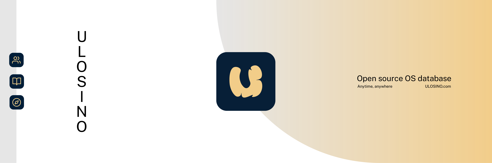

# ULOSINO

ULOSINO is the modern setting for Unix-like operating system information. A community project, ULOSINO aims to let you connect direct to culture.

Ensemble ULOSINO into your flow. Visit [ULOSINO.com](https://ulosino.com) now.

## Features

- Learn and discover in **speed and style**, optimised for both desktop and mobile
- Browse at night with automatic **dark mode**
- Take ULOSINO anywhere, even off-the-grid, with **offline compatibility**
- **Search by name, platform, desktop, and more**, efficiently and quickly
- Community contributions, bringing **up-and-coming distributions** on the same playing field

And more!

## How it works

1. Contributors create a commit to edit some Database Content;
2. The new package of Database Content is collected (with metadata and all) by the Source Code (at build), and;
3. Then the new build is shipped off to the user!

Read through [CONTRIBUTING.md](https://github.com/ulosino/ulosino/blob/main/CONTRIBUTING.md) for more details.

ULOSINO, as a whole stack, is divided into Database Content (`/public`) and the Source Code (`/src`), which live together on a modern Next.js application.

Contributions to the source are welcomed as well. Reference [STACK.md](https://github.com/ulosino/ulosino/blob/main/STACK.md) for an overview of the ULOSINO stack.

## License

ULOSINO is available for copy or study to the extent of the MIT Licence.

Review the [Contribution Code of Conduct](https://github.com/ulosino/ulosino/blob/main/CODE_OF_CONDUCT.md) before contributing.
