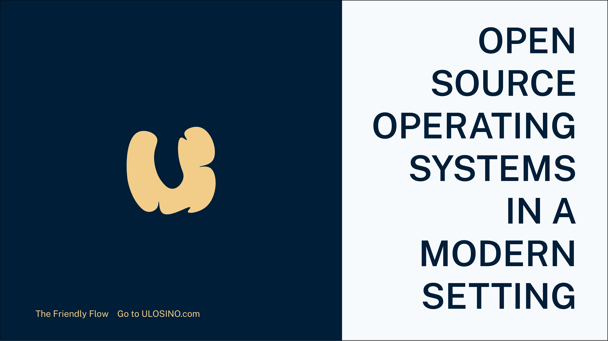

# ULOSINO

> **Notice:** ULOSINO is being sunset May 25th, 2022. ULOSINO will be superseded by Osopcloud in the future. Thank you for using ULOSINO.

ULOSINO is the modern setting for open source operating system information. Open to community contributions, ULOSINO aims to let you connect direct to culture.

ULOSINO is The Friendly Flow.

## Feature Overview

- Browse with **athletic speed**, on the Edge anywhere
- And **browse in style** with responsive dark mode
- Go anywhere, even off-the-grid, with **automatic offline**
- **Take a search from 10 metadata options**, efficiently and quickly
- **Make a donation** with ULOSINO Tempo donation options
- Open the joy from a flow that's made around you with **persistent Preferences**
- Community contributions, bringing **up-and-coming operating systems** on the same playing field

## How It Works

1. Database Content is edited, in the easy-to-use Markdown format, as a part of a commit, and;
2. Then the Database Content is processed by the Source Code and deployed on the Edge, powered by Vercel.

## Why?

We think that open source operating system software allows people and businesses to do more with less. Linux and other open source solutions are cheaper, more private, and more secure. A good example of this is cost; it is a major barrier for those in developing markets - being able to connect direct to the rest of the world is key to reducing poverty and improving living conditions for tens of millions of people around the world.

Different people and teams have different ways to approach cost, privacy, security, and ease of use. This fact leads to so many choices and many different operating systems being built and released into the wild. We believe that having a modern setting to explore the vast world of open source operating systems is essential for the adoption of open source OSs over the short- to medium-term in developing markets where internet coverage is poor and access is expensive.

Having access to a computer and internet connection really can be life changing. This is one of the reasons why The Friendly Flow provides ULOSINO Tempo donation options. The continuous evolution of the open source operating system ecosystem is what allows for growth, both for the open source OS market share and for the individual self.

## Technical Ethos

ULOSINO is wouldn't be possible without using modern technologies on an open source platform.

Our ambition is to make the hard easy. We've made discovering open source operating systems easy. We've made recommending open source operating systems easy with ULOSINO Matches. Plus, give capital with ULOSINO Tempo.

Behind the simplistic facade, you'll discover innovative and powerful features. 10-way search using metadata categories. Instant sorting. Reliable keyboard shortcuts.

Under the hood, ULOSINO runs a Next.js application with PWA web app functionality. Our PWA libraries deliver automatic content caching and offline capability. The key ingredient here is MDX, which is based on Markdown. Together with our free licensing model, this allows anyone to contribute changes to our rich collection of OS pages. (In fact, we make it easy; open an OS and click "View on GitHub"). It also allows us to deliver performance and consistency at scale. Even though we've only programmed around 14 pages, we deploy around 150 pages. Ultimately, this leads to the faster implementation of features and bug fixes.

## Contributions

We warmly welcome contributions! Take a look at our [Contribution Guide](https://github.com/ulosino/.github/blob/main/CONTRIBUTING.md) first.

You also need to read through the [Contribution Code of Conduct](https://github.com/ulosino/.github/blob/main/CODE_OF_CONDUCT.md) before contributing.

## Documentation

We've launched ULOSINO Documentation! It's complete with an assortment of tutorials and guides, ranging from ULOSINO basics to technical details.

Or visit the [ULOSINO Docs repository](https://github.com/ulosino/docs) for more details.

## Changelogs

This is the third major version of ULOSINO.

We use GitHub Releases and Git tags to manage changelogs. Read our [versioning documentation](https://docs.ulosino.com/docs/reference/versioning) to learn more.

## License

In the interest of the open source community, we have licensed ULOSINO under the Mozilla Public License 2.0.
